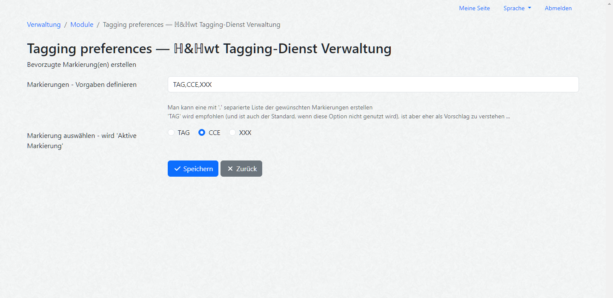
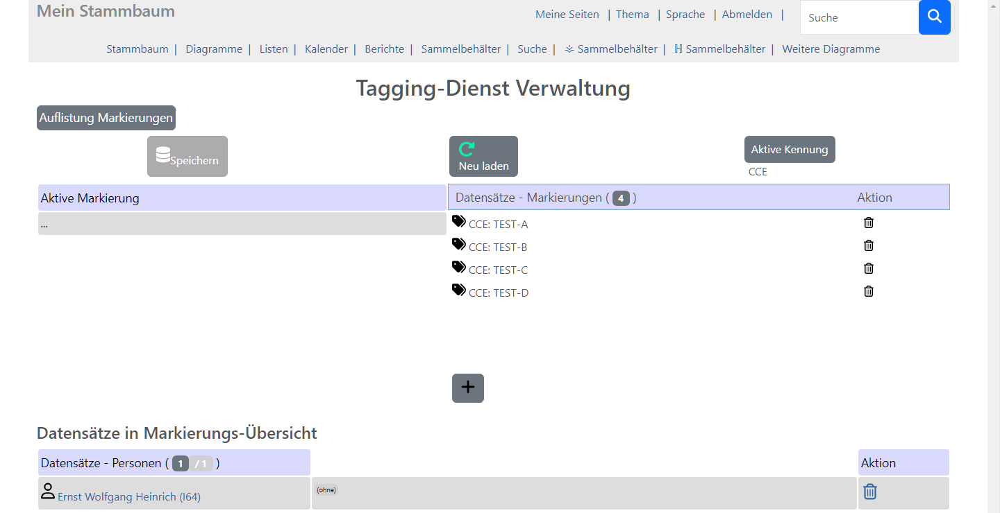
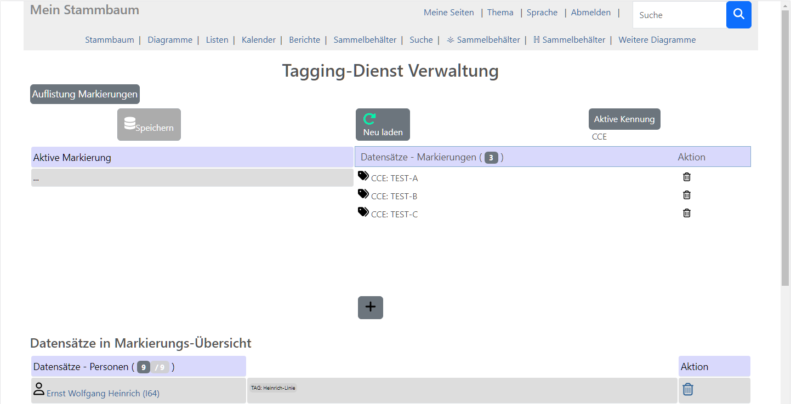
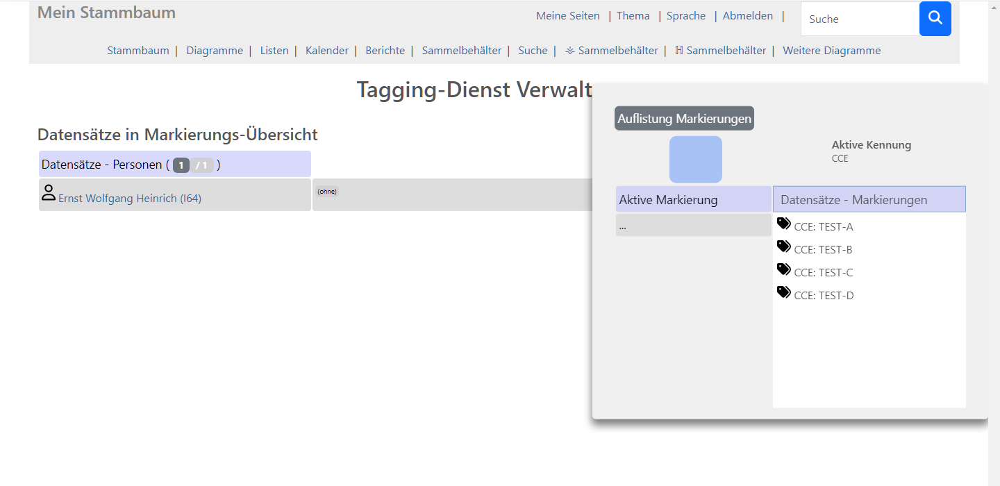
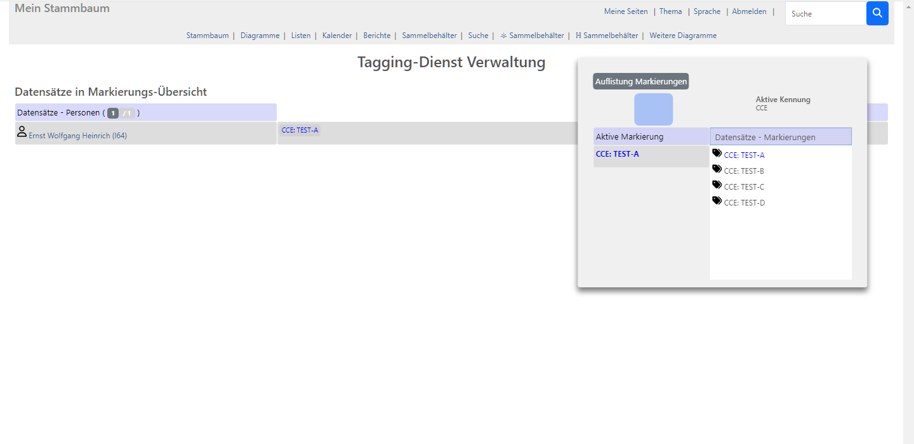
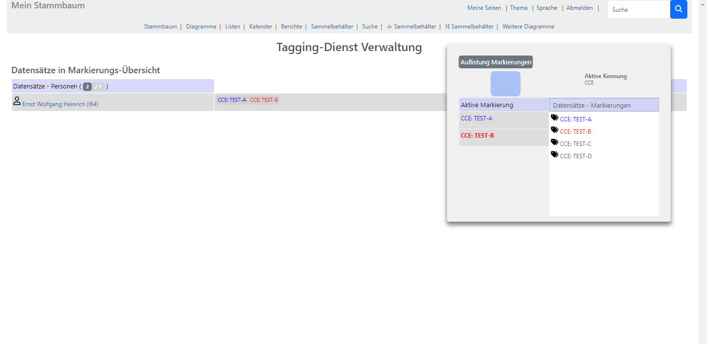

# webtrees module huhwt-tagging-service-manager

Dieses [webtrees](https://www.webtrees.net/) Modul ist ein Add-On zu **huhwt-cce** , dem Stammbaum-Sammelbehälter mit Erweiterungen.

Dies ist ein webtrees 2.2 Modul - kann nicht mit webtrees 2.1 benutzt werden.

Für Systeme mit webtrees 2.1 bitte das letzte Release aus dem huhwt-tsm Branch 2.1 verwenden.

Achtung:
~~~
  Dieses muß in einer PHP 8.3+ System-Umgebung betrieben werden.
~~~

## Inhalt
Dieses Readme enthält diese Haupt-Abschnitte:

* [Beschreibung](#description)
* [Voraussetzungen](#requirements)
* [Installation](#installation)
* [Upgrade](#upgrade)
* [Übersetzungen](#translation)
* [Contact Support](#support)
* [Danksagungen](#thanks)
* [Lizenz](#license)

## Beschreibung

### Einführung

Gedcom kennt das Struktur-Element NOTE. Es kann einer anderen Struktur untergeordnet sein, dann wird es spezifische Informationen und Ergänzungen zu dieser Struktur enthalten. Es kann aber auch eigenständig existieren, in diesem Fall enthält es übergreifend relevante Information und aus anderen Strukturen wird auf dieses NOTE-Element referenziert. Solche Top-Level-NOTEs werden in Webtrees als 'gemeinsame Notizen' bzw. 'shared notes' bezeichnet und an verschiedenen Stellen gesondert behandelt. (Gedcom 7 benennt sie folgerichtig in SNOTE um, NOTE gibt es dann nur noch als untergeordnetes Element).

Sind solche NOTEs einem definierten Schema folgend strukturiert, dann kann man zusätzliche Informations-Dimensionen aufspannen, indem z.B. allen Personen einer Stammlinie eine entsprechende (shared) NOTE zugewiesen wird und man sie fortan über dieses Merkmal unmittelbar selektieren kann.

### huhwt-tsm

Hier nun setzt dieses Modul an ...

Es funktioniert im wesentlichen als ergänzendes Element zu [huhwt-cce] (https://github.com/huhwt/huhwt-cce), dem CCE-Sammelkorb. Ist das TSM-Modul installiert, erscheint dort in der Sammelkorb-Ansicht ein zusätzliches Element in den Menü-Optionen: 'Übertragen an den Tagging-Service'. Beim Aufruf dieser Funktion wird der Inhalt der Personen- und Familien-Referenzen des Sammelkorbs in eine eigene Struktur übernommen. (Sammelkorb: Session-Struktur 'cart', Tagging-Service-Manager: Session-Struktur 'tags').

Die 'tags'-Struktur zieht nun die in Webtrees hinterlegten (shared) NOTEs an und zeigt, welche (s)NOTEs bereits hinterlegt sind und welche referenzierten Personen- und Familien-Datensätze diese (s)NOTEs zugeordnet haben.

Es werden nur solche (s)NOTEs erfasst, welche dem Schema 'TAG: ....' (Grundeinstellung) entsprechen. Das TSM-Modul kann in den Admin-Funktionen dahingehend konfiguriert werden, dass auch weitere Präfixe definierbar sind. Es ist jedoch nur jeweils der aktuell konfigurierte Präfix wirksam.

#### Konfiguration

In der Verwaltung - im Admin-Kontext - findet man in der Liste der Custom-Module 'ℍ&ℍwt Tagging-Dienst Verwaltung' mit einem Werkzeug-Symbol. Klick darauf öffnet die möglichen Einstellungen:

Man kann eine ganze Leiste von möglichen Markierungen nach Wunsch vorgeben. Ist diese Leiste leer, dann wird die Standardvorgabe 'TAG' benutzt. Gibt man mehrere Markierungen an, sind diese durch ',' (einfaches Komma) zu trennen.

Aus den möglichen Markierungen wählt man dann eine als die fürderhin 'Aktive Markierung' aus. Diese Kennung steuert die Auswahl der (s)NOTEs, welche in TSM behandelt werden.

#### Funktions-Bildschirm

Die TSM-Übersicht enthält zwei Blöcke: 'Auflistung Markierungen' und 'Datensätze in Markierungs-Übersicht'.

##### Auflistung Markierungen

In diesem Block wird das Inventar der hinterlegten TAGs aufgeführt und verwaltet. Der Block hat einen führenden Aktions- und darunter zwei nebeneinander angeordnete Funktions-Bereiche: Im rechten Bereich 'Datensätze Markierungen' wird das bekannte Inventar aufgelistet, der linke Bereich 'Aktive Markierung' ist anfänglich leer. Klickt man nun auf einen Eintrag im rechten Bereich, wird dieser farbig hervorgehoben und der Inhalt in den linken Bereich übernommen. Der Aktions-Bereich ist nicht speziell hervorgehoben, er enthält verschiedene Schaltflächen welche weiter unten erläutert werden.

Der linke Funktions-Bereich stellt die **'Aktive Markierung'** dar. Sind mehrere Einträge vorhanden, kann man durch Klick auf einen anderen Eintrag jeweils die 'Aktive Markierung' umsetzen. Die jeweils relevante 'Aktive Markierung' ist in der Ansicht durch Bold-Darstellung hervorgehoben.
'Aktiv' ist diese Markierung deshalb, weil jeder Klick auf einen Personen- oder Familien-Eintrag diese Markierung entweder zuordnet oder alternativ diese Zuordnung entfernt. Gibt es keine aktive Markierung, dann bewirken Klicks in den Personen- oder Familien-Einträgen keine Zuordnungen. Es gilt eine Beschränkung: Man kann maximal 6 aktive Markierungen parallel verwalten. Jeder Markierung ist eine eigene Farbe zugeordnet, der Farb-Vektor wird beim Zustands-Wechsel jeweils sequentiell durchlaufen und die 1. freie Farbe übernommen. Versucht man eine 7. Markierung zu aktivieren, wird das mit einem Warnhinweis abgelehnt.

Der rechte Funktions-Bereich **'Datensätze Markierungen'** listet alle dem Schema der 'Aktiven Kennung' entsprechenden (s)NOTEs auf. Durch Klick auf einen Eintrag wird dieser als 'Aktive Markierung' übernommen, ein weiterer Klick auf diesen Eintrag entfernt den korrespondierenden Eintrag links wieder. War dieser der aktuell aktive, dann wird links auf den jeweils vorher aktiven umgeschaltet, bis schließlich die linke Übersicht wieder leer ist. Die TAGs-Übersicht hat eine feste Größe, sind mehr TAGs im Inventar als in diesem Format darstellbar, schaltet die Übersicht auf Scroll-Ansicht um.

In der TAGs-Übersicht gibt es für die Einträge eine Lösch-Option (Trash-Symbol). Diese wirkt sowohl auf die Personen- und Familien-Einträge - die entsprechenden Markierungen dort werden entfernt - als auch auf die Datenbank: Der betreffende NOTE-Eintrag wird ohne Rückfrage gelöscht.

Der rechte Bereich erlaubt auch die Neu-Anlage eines TAGs. Das geschieht durch Klick auf das '+'-Symbol unterhalb der TAGs-Übersicht. Dabei werden grundsätzlich die Webtrees-Standardmechanismen zur Neuanlage einer (s)NOTE genutzt. Der Präfix 'TAG:' (fallweise die gewählte Alternative) ist dabei vorbelegt und muss zwingend im Text enthalten sein. Der NOTE-Eintrag in der Datenbank entspricht ansonsten den Webtrees-Konventionen. Die Operationen auf der Datenbank werden direkt umgesetzt, die fallweise erforderliche Bestätigung ist ausgesetzt.

[!IMPORTANT]
Neu angelegte TAGs können nicht direkt angezeigt werden. Man muss eine **Neu Laden** Aktion durchführen!

Die Überschrift **'Auflistung Markierungen'** ist selbst ein aktives Element, als Hinweis darauf verändert sich die Darstellung, wenn man mit der Maus darüberfährt. Der Klick auf die Überschrift stellt den ganzen Block frei, er wird ein vom Scroll-Kontext der Seite unabhängiges Element. Ein erneuter Klick bindet den Block wieder ein und die ganze Seite wird fallweise hochgescrollt.

Im eingebundenen Zustand zeigt der **Aktions-Bereich** des Blocks drei Schaltflächen - 'Speichern', 'Neu laden' und 'Aktive Kennung'.  
 * 'Speichern'-Schaltfläche
    Sie wird aktiviert, sobald eine erste Zuordnung vorgenommen wurde. Die **'Speichern'**-Schaltfläche überträgt das gesamte Inventar der 'Datensätze in Markierungsübersicht' auf die Server-Seite. Dort findet ein Abgleich mit dem Zustand der Markierungs-Zuordnungen in der 'tags'-Struktur statt. Neu zugeordnete bzw. entfernte Zuordnungen werden in die Datenbank übernommen. Die Operationen auf der Datenbank werden direkt umgesetzt, die fallweise erforderliche Bestätigung ist ausgesetzt. Die ganze Seite wird dann abschliessend neu aufgebaut.
 * 'Neu laden'-Schaltfläche
    Aktionen im Admin-Kontext - Wechsel der 'Aktiven Kennung' und das Neuanlegen unverbundener (s)NOTEs - sowie Aktionen im allgemeinen Webtrees-Kontext - Verknüpfung von Personen und Familien mit (s)NOTEs in den einschlägigen webtrees-Ansichten und Löschen einer (s)NOTE aus der entsprechenden Listen-Ansicht - führen dazu, dass die Zustände in der Datenbank nicht mehr mit dem Abbild in TSM übereinstimmen. Die **'Neu laden'**-Schaltfläche bewirkt, dass Zustand und Abbild wieder synchronisiert werden.
 * 'Aktive Kennung'-Schaltfläche
    Die 'Aktive Kennung' ist eine Einstellung in den Modul-Preferenzen. Webtrees erlaubt Zugriff dort nur im Admin-Kontext, das könnte dazu führen, dass man immer wieder dorthin und dann zurück in TSM wechseln müsste (nebst Synchronisierungs-Thematik). Die **'Aktive Kennung'**-Schaltfläche verkürzt den Prozess isofern, dass man in einer Übersicht der definierten Kennungen eine andere wählen kann, welche dann zur neuen Aktiven Kennung wird. Die Modul-Preferenz wird entsprechend umgesetzt und insbesondere auch dafür gesorgt, dass der 'tags'-Zustand mit der neuen Vorgabe synchronisiert ist.

Im freigestellten Zustand zeigt der Aktions-Bereich neben der Überschrift nur noch 2 Elemente: 'Speichern' und 'Neu laden' sind ausgeblendet, 'Aktive Kennung' ist nur noch informativ. Neu erschienen ist ein schlichtes Quadrat, welches als Aktionsfläche für eine Drag-n-Drop Funktion dient: Klicken und Ziehen dieser Fläche verschiebt den ganzen Aktions-Bereich.

Das Freistellen im Zusammenspiel mit wechselnder 'Aktiven Markierung' erlaubt es, auch in umfangreichen Datensammlungen vergleichsweise komfortabel TAGs nach Bedarf zu verwalten, da der Aktions-Bereich unabhängig vom Scrolling der Seite ist und die Markierungen immer im Zugriff sind.

##### Datensätze in Markierungs-Übersicht

Die Markierungs-Übersicht enthält die Blöcke der aus dem Sammelkorb übernommenen Personen- und Familien-Datensätze. Jeder Datensatz-Eintrag hat drei Bereiche: links die Personen-/Familien-Kennung, in der Mitte den Zuordnungs-Bereich und rechts den Aktions-Bereich.
- Der Kennungsbereich zeigt den Namen-Link, ein Klick darauf wechselt in die Einzelansicht.
- Der Zuordnungsbereich führt die einem Eintrag zugeordneten TAGs auf. Die Markierung '(ohne)' zeigt an, dass es noch keine Zuordnungen gibt.
- Der Aktions-Bereich hat eine Lösch-Option, diese wirkt auf die 'tags'- wie auch die 'cart'-Struktur. Klick auf die Lösch-Option entfernt den Eintrag sowohl aus dem Tagging-Service-Manager als auch dem Sammelkorb. Er steht für weiterführende Aktionen nicht mehr zur Verfügung und vorhandene (s)NOTE-Zuordnungen können nicht mehr bearbeitet werden. Das Löschen kann nicht rückgängig gemacht werden (es sei denn durch Wiederholen der korrspondierenden Sammelaktionen).

Haben die gesammelten Personen-/Familien-Einträge keine Zuordnung zu einer (s)NOTE, dann ist dort '(ohne)' vermerkt. Klickt man einen solchen Eintrag an, wird statt dessen dann die aktive Markierung mit entsprechender Farbkennung angezeigt. Nach Wechsel auf eine andere 'Aktive Markierung' und Klick auf einen Eintrag mit vorhandener Zuordnung wird die aktuelle 'Aktive Markierung' zusätzlich aufgenommen - bzw. entfernt, wenn eine vorhandene Zuordnung der aktiven Markierung entspricht. Der Zuordnungs-Bereich hat keine Beschränkung in Bezug auf die Zahl der Zuordnungseinträge.

[!IMPORTANT]
Die Zuweisungen/Rücknahmen von Markierungen in der Markierungs-Übersicht sind temporär! Der dargestellte Zustand wird erst durch die 'Speichern'-Aktion in die Datenbank übernommen!

Die Operationen auf der Datenbank werden direkt umgesetzt, die fallweise erforderliche Bestätigung ist ausgesetzt. Hat man eine Person/Familie in einem parallelen Browser-Tab im Zugriff und weist dieser eine Markierung zu, erscheint in der parallelen Ansicht nach einem Refresh unmittelbar der neue Zustand.

### Zusammenfassung

Die 'gemeinsamen Notizen' bzw. (s)NOTEs stellen eine eigene Informations-Dimension in Webtrees dar. Ihre Verwendung ist in den Standard-Routinen vergleichsweise schwerfällig, man muss in einem kleinteiligen Vorgehen für jede Entität jede (s)NOTE explizit auswählen und zuweisen.

Als Ergänzung des CCE-Sammelkorbs erlaubt dieses Modul nun eine sehr effiziente Handhabung ausgewählter (s)NOTEs. Mit einer geeigneten CCE-Sammelaktion kann eine Vielzahl von Personen- und Familien-Referenzen zusammen geführt auf den Schirm gebracht und dort mit einfachen Mausaktionen verwaltet werden. Eine abschliessende Speicher-Aktion schreibt alle veränderten Zuordnungen in 1 Aufruf auf die Datenbank zurück. Die Operationen auf der Datenbank werden unmittelbar umgesetzt, ohne sie jeweils separat bestätigen zu müssen. Sie folgen ansonsten den Webtrees-Konventionen, so dass sie im Änderungs-Protokoll nachvollziehbar sind.

Die vereinfachte Zuweisung und Entfernung der (s)NOTEs und die erweiterte Fähigkeit des CCE-Sammelkorbs, Personen- und Familien-Referenzen aus der NOTE-Liste abzuleiten, lässt es nunmehr zu, ganze Teil-Stammbäume abzugreifen und für spezielle Zwecke gezielt auszukoppeln.

## Voraussetzungen

Dieses Modul setzt mindestens **PHP 8.3** voraus.
Dieses Modul setzt mindestens **Webtrees** Version 2.2.0.0 voraus.
Dieses Modul hat ansonsten die gleichen allgemeinen Anforderungen wie für **Webtrees** insgesamt genannt [webtrees#system-requirements](https://github.com/fisharebest/webtrees#system-requirements).

## Installation

In diesem Abschnitt wird beschrieben, wie Sie dieses Modul installieren.

1. Laden Sie die [Neueste Version] (https://github.com/huhwt/huhwt-tsm/releases/latest) herunter.
2. Entpacken Sie es in das Verzeichnis `webtrees/modules_v4` auf dem Webserver.
3. Benennen Sie den Ordner fallweise in `huhwt-tsm` um. Wenn der Ordner bereits existiert, kann er einfach überschrieben werden. 

## Upgrade

Um die neueste Version zu erhalten, ersetzen Sie einfach die vorhandenen huhwt-tsm-Dateien mit denen der neuesten Version.

## Übersetzungen

Sie können bei der Übersetzung dieses Moduls helfen. 
Aktualisierte Übersetzungen werden mit der nächsten Version des Moduls verteilt.

Derzeit gibt es nur Übersetzung ins Deutsche.

## Support

Issues: Fehler bitte in diesem GitHub-Repository melden.

Forum: Allgemeine Webtrees Hilfe findet man auch im 
[Webtrees Forum](http://www.webtrees.net/)

## Danksagungen

Heißen Dank an [Hermann Hartenthaler](https://github.com/hartenthaler/) für die Grundidee zu diesem Modul.

## Lizenz

* Copyright (C) 2023/2024 huhwt - EW.H
* Derived from **webtrees** - Copyright 2024 webtrees development team.

Dieses Programm ist quelloffen und unterliegt den Bedingungen der GNU General Public License, entweder der Version 3 der Lizenz oder (nach Ihrer Wahl) einer späteren Version.

Sie sollten eine Kopie der GNU General Public License zusammen mit diesem Programm erhalten haben, falls nicht, siehe <http://www.gnu.org/licenses/>.

This program is distributed in the hope that it will be useful,
but WITHOUT ANY WARRANTY; without even the implied warranty of
MERCHANTABILITY or FITNESS FOR A PARTICULAR PURPOSE. See the
GNU General Public License for more details.

You should have received a copy of the GNU General Public License
along with this program. If not, see <http://www.gnu.org/licenses/>.

* * *
